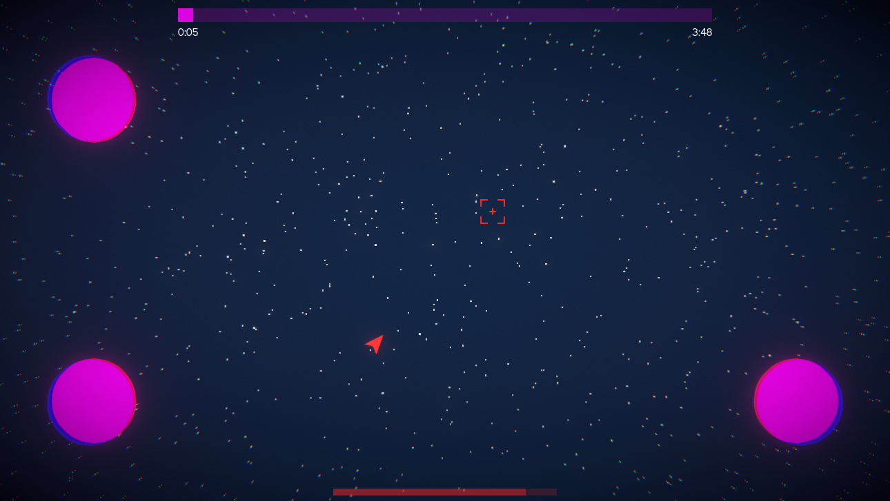
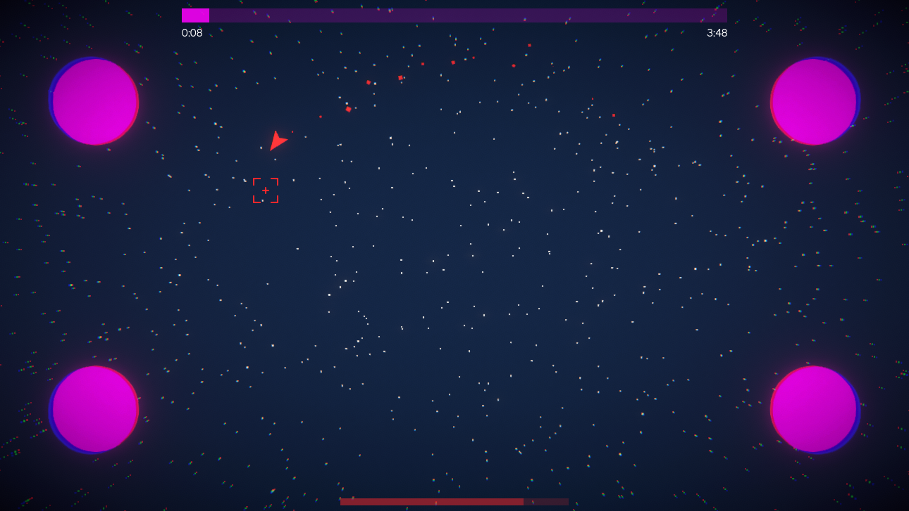
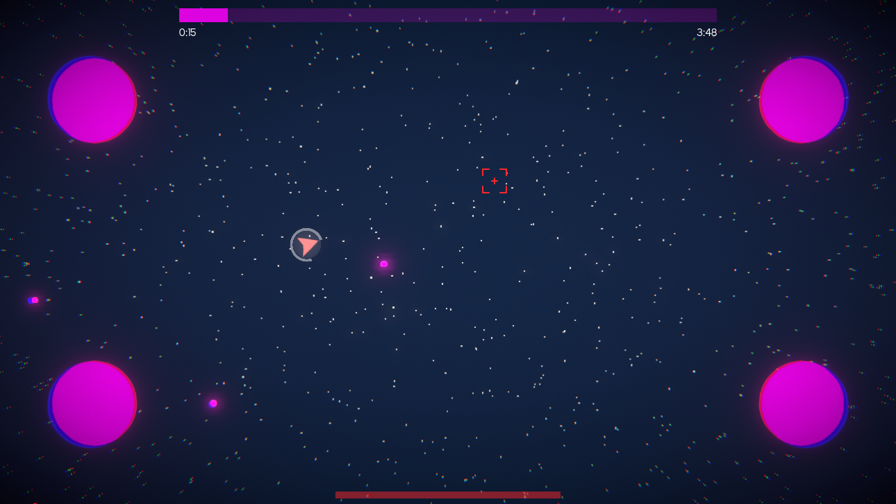
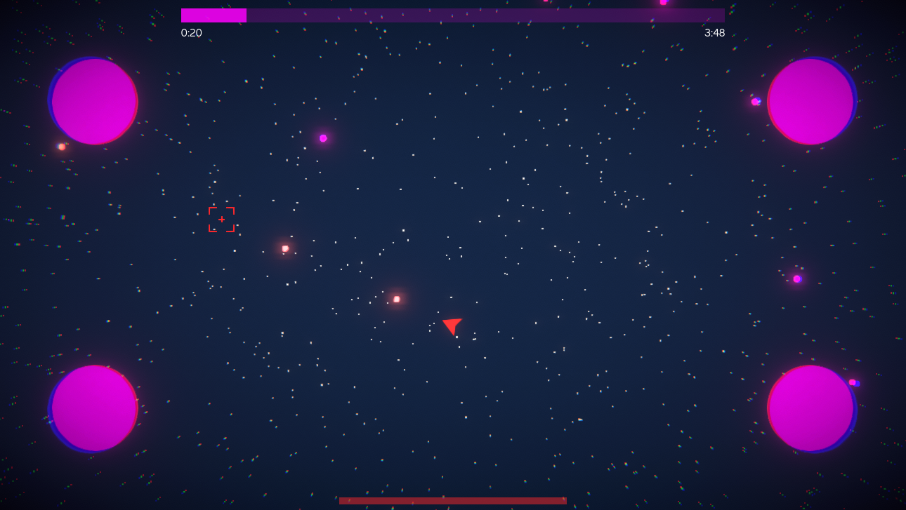
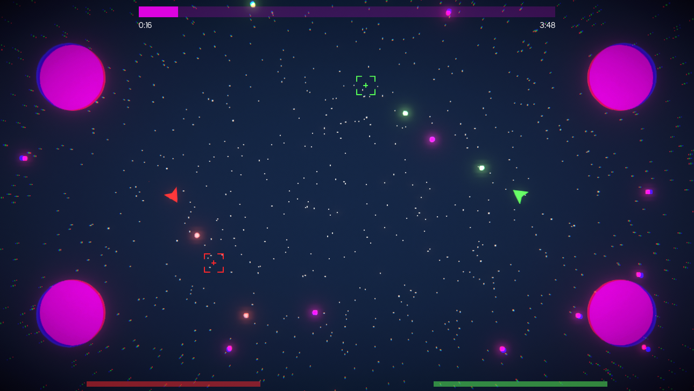
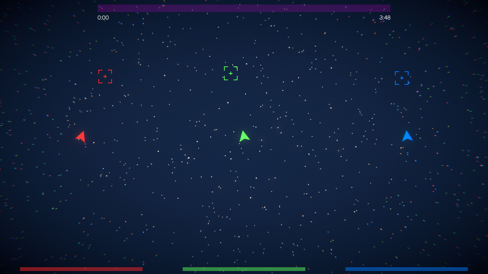

# SHMUP

## About
A very simple "Shoot 'em Up" style game with local co-op and keyboard/controller cross-play. The game is inspired by [Just Shapes & Beats](https://www.justshapesandbeats.com/) hence the code name "Neither Shaped nor Beats". The game only contains the first 30 seconds of the first level as it was just created as a proof of concept over the span of 2 days.

## Features
- Stylistic game and UI design
- Timeline based level editor
- Up to 4 player co-op
- Simultaneous keyboard and controller players
- Intuitive controls on various input devices
- Controller haptic feedback
- Music synchronized gameplay (will be automated)
- 'Squishing' player animations indicate acceleration
- Particle system trails
- Post processing effects
- Immersive health bar with invulnerability stage

## Images
<!--    -->

  

  

  

  

## Known Issues
- Game won't start unless a controller is connected even if it isn't used
- Any player damage/death triggers haptics on all controllers for all players

## License
[BSD-3-Clause License](LICENSE)